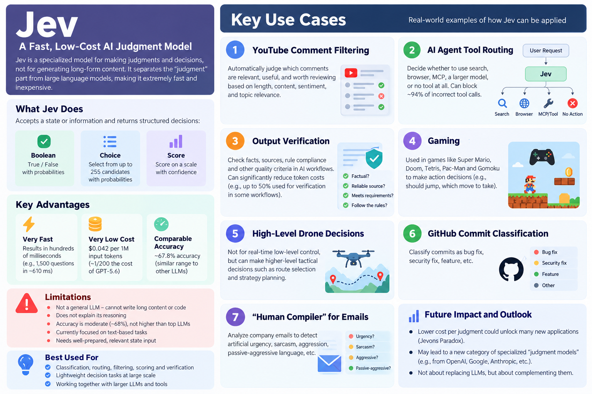

## Jev Model — Quick Introduction

### Jev Model — Quick Introduction
- https://typesafe.ai/
  
**Jev is a lightweight probabilistic decision model developed by TypeSafe AI. It is available directly from TypeSafe AI and through platforms such as Vercel AI Gateway and Cloudflare.**

* **Who built it:** Vercel
* **What it does:** Takes structured or semi-structured information and quickly produces a **decision, classification, score, or probability**.
* **Main strength:** It is particularly useful when you already have the relevant **state/context** and want the model to determine **what action or outcome is appropriate**.
* **Efficient:** Jev is designed to be much smaller and cheaper to run than large general-purpose LLMs.
* **Tool/Agent routing:** It can be used as a lightweight decision layer to determine **which model, tool, API, or workflow should be invoked**, instead of sending every request to an expensive LLM.
* **Structured decisions:** It is well suited to tasks such as **Yes/No decisions, multi-class choices, scoring, ranking, and probability estimation**.
* **Potential applications:** Agent routing, workflow automation, recommendation systems, risk assessment, weather decision systems, and other applications where **fast structured reasoning over a known state** is more important than generating long-form text.

In simple terms:

> **LLMs are optimized to generate answers; Jev is optimized to make decisions.**

### APIs Available:
- Vercel: https://vercel.com/ai-gateway/models/jev
  - Vercel Guide: https://vercel.com/connect/jev
  - Vercel 6 ways to integrate Jev: https://vercel.com/connect/jev
- CloudFlare: https://developers.cloudflare.com/workers-ai/models/

